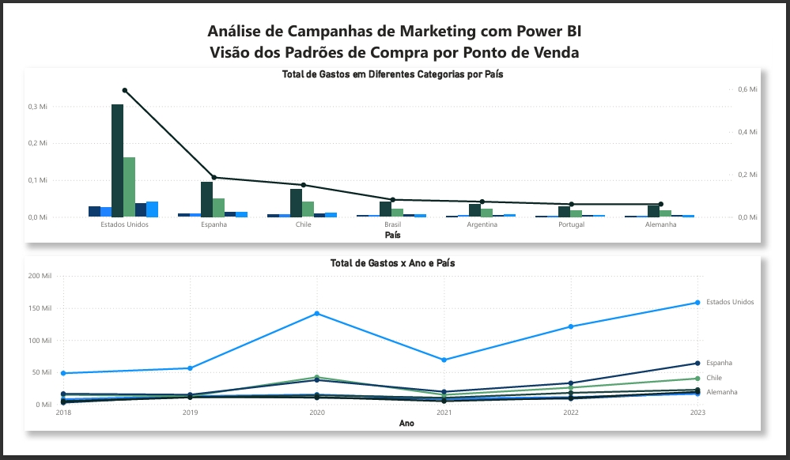

# Análise de Campanhas de Marketing com Power BI - Mini-Projeto 1 (DSA)

## Sumário

- [Introdução](#introdução)
- [Visão do Cliente](#visão-do-cliente)
- [Visão do Comportamento](#visão-do-comportamento)
- [Visão das Campanhas](#visão-das-campanhas)
- [Visão dos Pontos de Venda](#visão-dos-pontos-de-venda)

## Introdução

Este projeto foi desenvolvido como parte do Mini-Projeto 1 do curso Microsoft Power BI para Business Intelligence e Data Science da DSA.

O objetivo é analisar campanhas de marketing por meio de dashboards construídos no Power BI, explorando diferentes perspectivas dos dados.

A análise foi estruturada em quatro visões principais: Cliente, Comportamento, Campanhas e Pontos de Venda. Cada uma delas aborda aspectos específicos para melhor compreensão do perfil dos clientes e da efetividade das campanhas.

## Visão do Cliente

Nesta seção, são analisadas características demográficas dos clientes: escolaridade, estado civil, faixa salarial e padrões de compra.

## Visão do Comportamento

Aqui, o foco é compreender o comportamento de consumo dos clientes, relacionando gastos com variáveis como renda, número de filhos, estado civil e nível de escolaridade.

## Visão das Campanhas

Esta análise busca identificar o perfil dos clientes que aderiram (ou não) às campanhas de marketing, permitindo avaliar sua efetividade.

## Visão dos Pontos de Venda

Nesta etapa, são analisados os produtos mais vendidos ao longo do tempo e em diferentes localidades, permitindo identificar padrões regionais e tendências de vendas.

