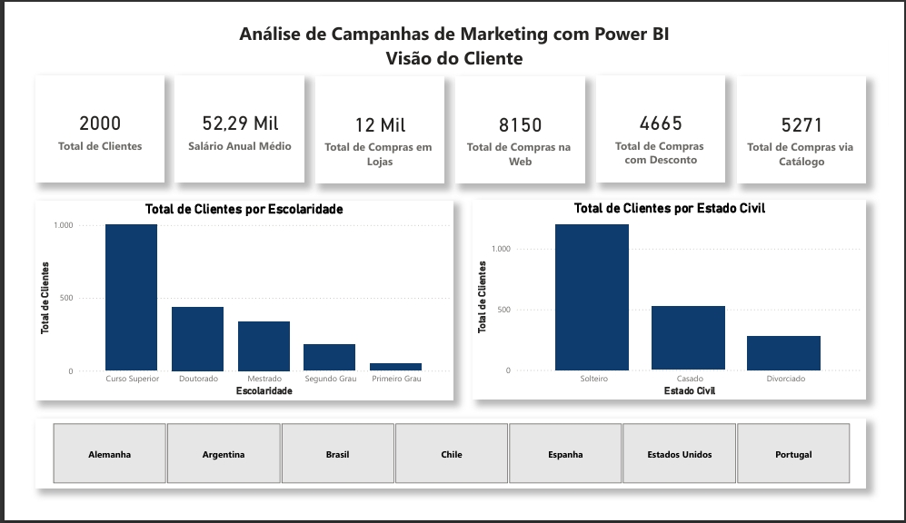
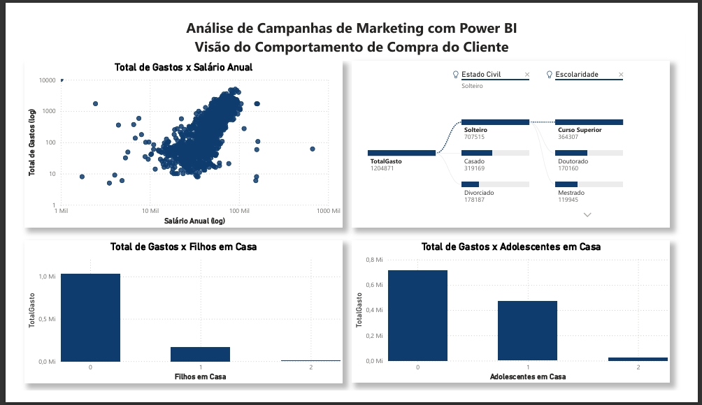
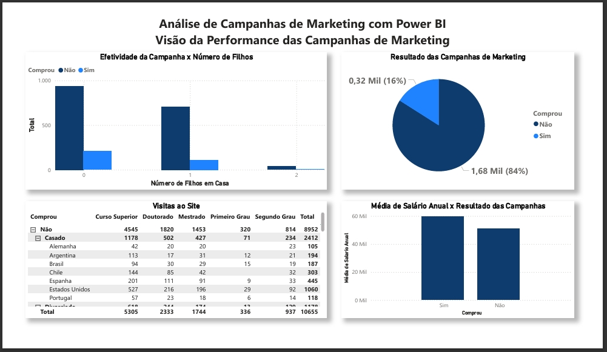

# Análise de Campanhas de Marketing com Power BI - Mini- Projeto-1 - DSA

## Sumário

- [Introdução](#introdução)
- [Visão do Cliente](#visão-do-cliente)
- [Visão do Comportamento](#visão-do-comportamento)
- [Visão das Campanhas](#visão-das-campanhas)

## Introdução

Este projeto tem como objetivo realizar o Mini-Projeto 1 do curso Microsoft Power BI para Business Intelligence e Data Science da DSA. Este projeto visa analisar campanhas de marketing usando como ferramenta o Power BI.

O projeto foi dividio em 4 partes: Visão do Cliente, Visão do Comportamento, Visão das Campanhas e Visão dos Pontos de Venda. As seções seguintes eploram cada um as das 4 partes.

## Visão do Cliente

Essa parte visa analisar o número de clientes em vários aspectos: escolaridade, estado civil, salário e tipos de compra.

## Visão do Comportamento

Essa parte tem como objetivo analisar o comportamento dos clientes em relação aos gastos considerando o salário, número de filhos em casa, estado civil e escolaridade.

## Visão das Campanhas

Essa parte visa entender o perfil dos clientes que compraram ou não os produtos.

## Visão dos Pontos de Venda

Essa parte tem por objetivo que tipos de produtos venderam mais em várias localidades e por ano.

